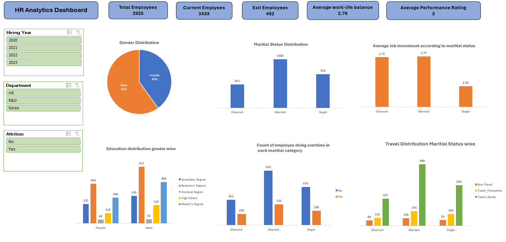

# HR Analytics Dashboard

## Overview
This project involves an HR Analytics Dashboard built using Microsoft Excel. The dashboard provides key insights into employee demographics, work-life balance, performance ratings, and other HR metrics. The data is processed using pivot tables and visualized using various graphs and slicers to facilitate better decision-making.

## Features
The HR Analytics Dashboard includes the following features:

- **Key Performance Indicators (KPIs):**
  - Total Employees
  - Current Employees
  - Exit Employees
  - Average Work-Life Balance
  - Average Performance Rating

- **Data Filters (Slicers):**
  - Hiring Year (2020, 2021, 2022, 2023)
  - Department (HR, R&D, Sales)
  - Attrition (Yes, No)

- **Visualizations:**
  - **Gender Distribution:** Pie chart representing the percentage of male and female employees.
  - **Marital Status Distribution:** Bar chart displaying the count of employees based on marital status (Divorced, Married, Single).
  - **Average Job Involvement by Marital Status:** Bar chart showing average job involvement for different marital statuses.
  - **Education Distribution by Gender:** Bar chart categorizing employees based on gender and educational qualifications (Associate's Degree, Bachelor's Degree, Doctoral Degree, High School, Master's Degree).
  - **Overtime Count by Marital Status:** Bar chart showing the count of employees working overtime across different marital categories.
  - **Travel Distribution by Marital Status:** Bar chart indicating the travel frequency of employees segmented by marital status.

## Project Structure
The Excel file consists of the following sheets:

1. **Raw Data:** Contains the original employee data.
2. **Pivot:** Contains pivot tables summarizing key HR metrics.
3. **Dashboard:** Presents the visualizations and KPIs for easy analysis.

## How the Dashboard Operates
1. Open the `HR Data.xlsx` file in Microsoft Excel.
2. Navigate to the `Dashboard` sheet to view the visual insights.
3. Use the slicers to filter data based on hiring year, department, and attrition status.
4. The pivot tables in the `Pivot` sheet automatically update when the raw data is modified.
5. The graphs and KPIs on the dashboard provide a comprehensive overview of employee demographics and trends.
6. Analyze trends based on different demographic factors such as gender and education.

## Data Insights
- **Employee Demographics:**
  - 60% Male and 40% Female employees.
  - Majority of employees are married.
- **Job Involvement:**
  - Divorced and Married employees have the highest job involvement.
- **Overtime Trends:**
  - Married employees contribute the most to overtime.
- **Travel Patterns:**
  - Married employees travel rarely compared to others.

## Additional Details
- The dashboard allows users to dynamically explore HR data using slicers for department, hiring year, and attrition status.
- It provides actionable insights that help HR teams make informed decisions about workforce management.
- The pivot tables automatically update when new data is added, making it easy to maintain and expand.
- Performance and work-life balance ratings provide insights into employee satisfaction and areas for improvement.

